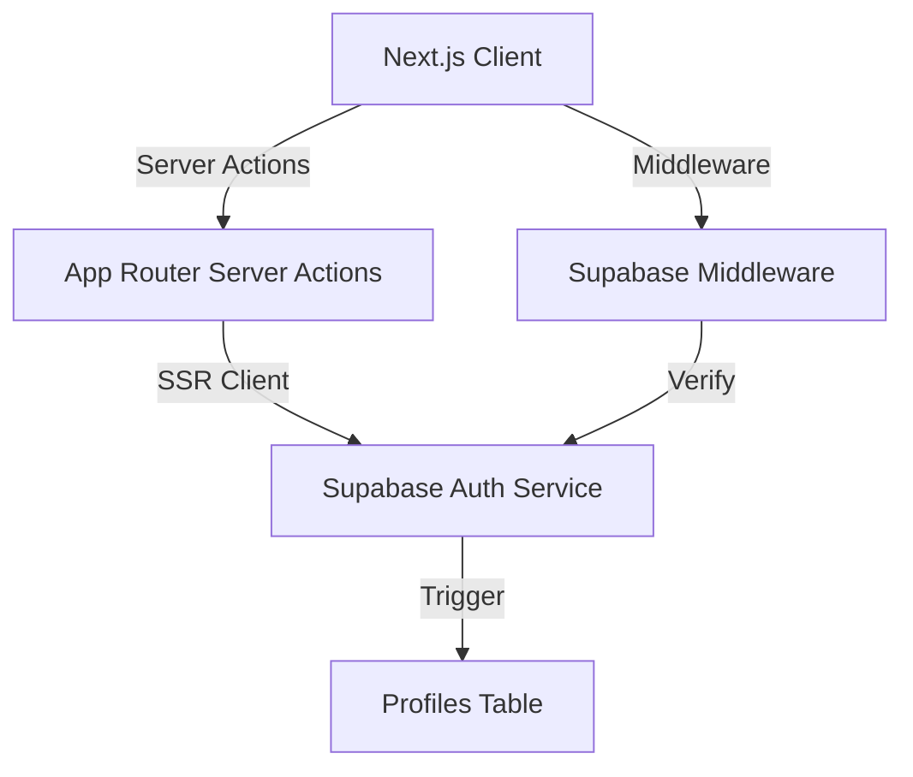

# Complete Technical Context: Authentication & Backend Architecture

This document provides an exhaustive technical reference for the **Tj's Medical Hub** authentication system, database schema, and backend logic. It is designed to enable an AI model to replicate, replace, or upgrade the system with full context.

---

## 1. System Architecture Overview



---

## 2. Database Schema (Inferred DDL)

The system uses a relational PostgreSQL schema managed via Supabase.

### A. Table: `profiles`
Extends `auth.users` with application-specific metadata.
```sql
CREATE TABLE public.profiles (
  id UUID PRIMARY KEY REFERENCES auth.users(id) ON DELETE CASCADE,
  full_name TEXT NOT NULL,
  email TEXT, -- Synced from auth.users
  role TEXT CHECK (role IN ('doctor', 'patient')),
  medical_history TEXT, -- Patient only
  allergies TEXT,       -- Patient only
  date_of_birth DATE,   -- Patient only
  specialty_id UUID REFERENCES public.specialties(id), -- Doctor only
  bio TEXT,             -- Doctor only
  updated_at TIMESTAMPTZ DEFAULT NOW()
);
```

### B. Table: `appointments`
Core business logic table.
```sql
CREATE TABLE public.appointments (
  id UUID PRIMARY KEY DEFAULT uuid_generate_v4(),
  patient_id UUID REFERENCES public.profiles(id),
  doctor_id UUID REFERENCES public.profiles(id),
  specialty_id UUID REFERENCES public.specialties(id),
  appointment_date TIMESTAMPTZ NOT NULL,
  reason_for_visit TEXT,
  status TEXT DEFAULT 'pending' CHECK (status IN ('pending', 'accepted', 'rejected')),
  deleted_at TIMESTAMPTZ, -- Soft delete field
  created_at TIMESTAMPTZ DEFAULT NOW()
);
```

### C. Table: `specialties`
Reference table for medical fields.
```sql
CREATE TABLE public.specialties (
  id UUID PRIMARY KEY DEFAULT uuid_generate_v4(),
  name TEXT UNIQUE NOT NULL
);
```

---

## 3. Backend Logic: Server Actions (`app/login/actions.jsx`)

### A. Signup Implementation
Passes metadata to Supabase `signUp`, which triggers a profile creation.
```javascript
export async function signup(formData) {
    const supabase = await createClient()
    const email = formData.get('email')
    const password = formData.get('password')
    const fullName = formData.get('fullName')
    const role = formData.get('role') // 'doctor' or 'patient'

    const { error } = await supabase.auth.signUp({
        email,
        password,
        options: {
            data: {
                full_name: fullName,
                role: role,
            },
        },
    })
    if (error) return redirect('/login?error=' + encodeURIComponent(error.message))
    
    // Redirect based on role
    redirect(role === 'doctor' ? '/employee/dashboard' : '/patient/dashboard')
}
```

### B. Login Implementation
```javascript
export async function login(formData) {
    const supabase = await createClient()
    const { data, error } = await supabase.auth.signInWithPassword({
        email: formData.get('email'),
        password: formData.get('password')
    })

    if (error) return redirect('/login?error=' + encodeURIComponent(error.message))

    const { data: profile } = await supabase
        .from('profiles')
        .select('role')
        .eq('id', data.user.id)
        .single()

    revalidatePath('/', 'layout')
    redirect(profile?.role === 'doctor' ? '/employee/dashboard' : '/patient/dashboard')
}
```

---

## 4. Supabase SSR Configuration (`utils/supabase/server.js`)

This setup ensures session persistence across Server Components, Actions, and Route Handlers.

```javascript
import { createServerClient } from '@supabase/ssr'
import { cookies } from 'next/headers'

export async function createClient() {
    const cookieStore = await cookies()
    return createServerClient(
        process.env.NEXT_PUBLIC_SUPABASE_URL,
        process.env.NEXT_PUBLIC_SUPABASE_PUBLISHABLE_KEY,
        {
            cookies: {
                getAll() { return cookieStore.getAll() },
                setAll(cookiesToSet) {
                    try {
                        cookiesToSet.forEach(({ name, value, options }) =>
                            cookieStore.set(name, value, options)
                        )
                    } catch {} // Handled if called from Server Component
                },
            },
        }
    )
}
```

---

## 5. Middleware & Session Refreshing (`lib/middleware.jsx`)

The middleware is intended to refresh the session and handle route protection.

```javascript
export async function updateSession(request) {
  let supabaseResponse = NextResponse.next({ request })
  const supabase = createServerClient(...) // SSR Setup

  // Crucial: getClaims() or getUser() keeps the session alive
  const { data } = await supabase.auth.getClaims()
  const user = data?.claims

  if (!user && !request.nextUrl.pathname.startsWith('/login')) {
    const url = request.nextUrl.clone()
    url.pathname = '/login'
    return NextResponse.redirect(url)
  }

  return supabaseResponse
}
```

---

## 6. Frontend Authentication Integration

### A. Header Component Logic (`components/header.jsx`)
Server-side check to determine UI state.
```javascript
export default async function Header() {
    const supabase = await createClient()
    const { data: { user } } = await supabase.auth.getUser()

    return (
        <nav>
            {user ? (
                <><span>{user.email}</span><SignOutButton action={signout} /></>
            ) : (
                <Link href="/login">Log in</Link>
            )}
        </nav>
    )
}
```

### B. Page-Level Protection Pattern
```javascript
export default async function ProtectedPage() {
    const supabase = await createClient()
    const { data: { user }, error } = await supabase.auth.getUser()
    
    if (error || !user) redirect('/login')
    
    // Optional: Role-based check
    // if (user.user_metadata.role !== 'doctor') redirect('/')
}
```

---

## 7. Known Issues & Security Considerations

1.  **Missing Root Middleware**: Although `lib/middleware.jsx` exists, there is no `middleware.js` in the project root to activate it. This means sessions may expire without refreshing and routes aren't protected globally.
2.  **Duplicate Client Logic**: Auth clients are defined in both `@/lib/` and `@/utils/supabase/`.
3.  **Soft Delete Implementation**: Appointments are "deleted" by setting `deleted_at`. All queries MUST include `.is('deleted_at', null)` to avoid showing deleted records.
4.  **Role Synchronization**: The `role` is stored in both `auth.users` metadata (for quick access) and the `profiles` table (for relational queries). Any upgrade must ensure these remain consistent.
5.  **RLS Policies**: The database is assumed to have Row Level Security (RLS) enabled, specifically for the `appointments` table where `doctor_id` or `patient_id` must match the `auth.uid()`.

---
*End of Technical Context*
